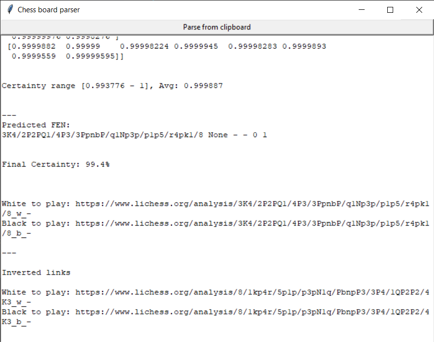

# TensorFlow Chessbot Parser

Parse FEN from clipboard image and analyse on https://lichess.org

---
## Desktop application



See [releases page](https://github.com/ntnbrtnkv/tensorflow_chessbot/releases) for executable files

Build with TkInter

### Creating release

```
pyinstaller --clean chess_parser.spec
```

## Command Line Interface (CLI)

### Setting up the virtual environment

This uses Python 3.7 (see `.python-version`), pip3 and virtualenv, if you don't have these installed you can use:

```
sudo apt-get install python3-pip
sudo pip3 install virtualenv
```

Then, create a new virtual environment, source it, and install the dependencies from `requirements.txt`.

```
virtualenv venv
source venv/bin/activate
pip3 install -r requirements.txt 
```

### Running the CLI

`tensorflow_chessbot.py` contains the library and script for running predictions on images passed by file or url.

```
$ ./tensorflow_chessbot.py -h
usage: tensorflow_chessbot.py [-h] [--url URL] [--filepath FILEPATH]
 
 Predict a chessboard FEN from supplied local image link or URL
 
 optional arguments:
   -h, --help           show this help message and exit
   --url URL            URL of image (ex. http://imgur.com/u4zF5Hj.png)
  --filepath FILEPATH  filepath to image (ex. u4zF5Hj.png)
```

For example to run on the provided `example_input.png` 

```
./tensorflow_chessbot.py --filepath example_input.png
```

Should output something like:

```
(venv) $ ./tensorflow_chessbot.py --filepath example_input.png

--- Prediction on file example_input.png ---
   Loading model 'saved_models/frozen_model.pb'
   Model restored.
Closing session.
Per-tile certainty:
[[1. 1. 1. 1. 1. 1. 1. 1.]
 [1. 1. 1. 1. 1. 1. 1. 1.]
 [1. 1. 1. 1. 1. 1. 1. 1.]
 [1. 1. 1. 1. 1. 1. 1. 1.]
 [1. 1. 1. 1. 1. 1. 1. 1.]
 [1. 1. 1. 1. 1. 1. 1. 1.]
 [1. 1. 1. 1. 1. 1. 1. 1.]
 [1. 1. 1. 1. 1. 1. 1. 1.]]
Certainty range [0.999975 - 1], Avg: 0.999997
---
Predicted FEN: bn4kN/p5bp/1p3npB/3p4/8/5Q2/PPP2PPP/R3R1K1
Final Certainty: 100.0%
```

Which would be 

## Running with Docker

Automated build on Docker available at `elucidation/tensorflow_chessbot`

Populate your own `auth_config.py` which has the form

```py
USERNAME='<NAME>'
PASSWORD='<PASSWORD>'
USER_AGENT='<AGENT INFO>'
```


Then you can download and run the docker image passing this config file using:

```
docker run -dt --rm --name cfb -v <local_auth_file>:/tcb/auth_config.py elucidation/tensorflow_chessbot
```
